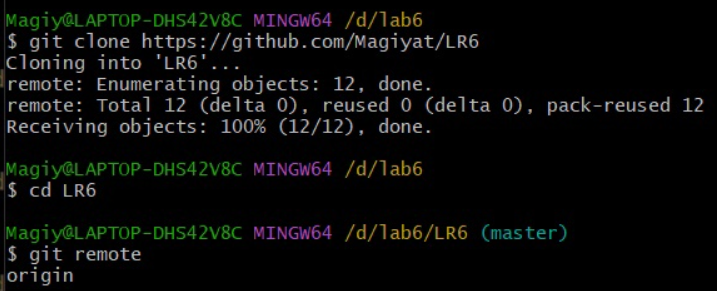
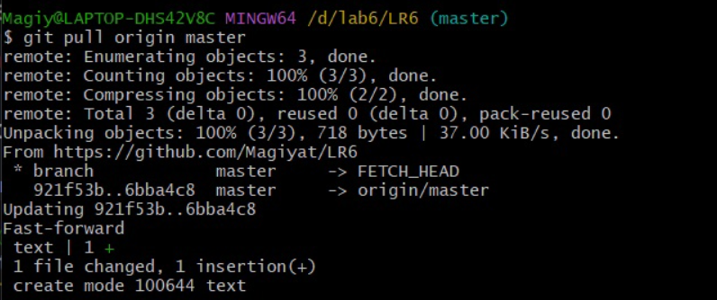
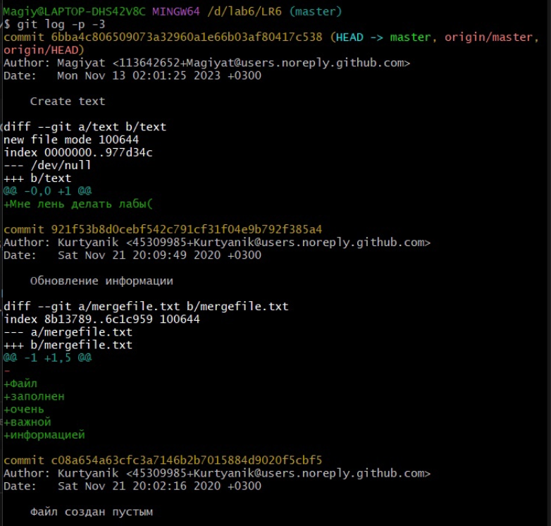

# LR6
## Лабораторная работа №6 Система контроля версий 
### Цель лабораторной работы: изучение базовых возможностей системы управления версиями, опыт работы с Git Api, опыт работы с локальным и удаленным репозиторием.
### 1. Клонирование в личный удалённый репозиторий

### 2. Добавление файла через интерфейс GitHub.

### 3. Получение истории операций для каждой из веток

### 4. Последние изменения

### 5. Слияние в ветку master, разрешив конфликт

### 6. Удаление побочной ветку после успешного слияния.

### 7. Зафиксированные изменения

### 8. Откат коммита

### 9. Создание ветки для отчета

