# LR6
## Лабораторная работа №6 Система контроля версий 
### Цель лабораторной работы: изучение базовых возможностей системы управления версиями, опыт работы с Git Api, опыт работы с локальным и удаленным репозиторием.
### 1. Клонирование в личный удалённый репозиторий

Рисунок 1 - Клонирование репозитория 

### 2. Добавление файла через интерфейс GitHub.

Рисунок 2 - Подтягивание изменений  

### 3. Получение истории операций для каждой из веток
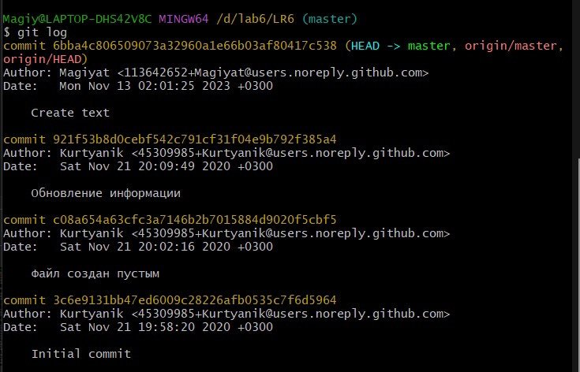

Рисунок 3 - Получение истории операций 

### 4. Последние изменения
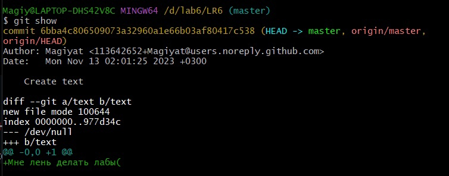

Рисунок 4 - Последние изменения

### 5. Слияние в ветку master, разрешив конфликт
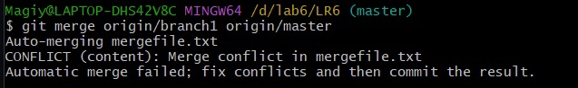

Рисунок 5 - Слияние веток

Возник конфлик из-за файла с разным содержанием. Были внесены изменения в файл mergefile.txt для решения конфликта. 
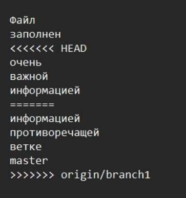

Рисунок 6 - Содержимое конфликтующего файла

### 6. Удаление побочной ветки после успешного слияния.
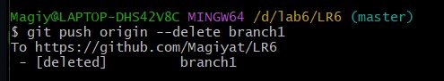

Рисунок 7 - Удаление ветки 

### 7. Зафиксированные изменения
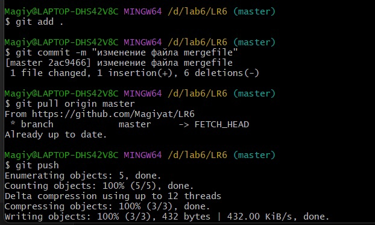

Рисунок 8 - Коммит изменения файла merdefile

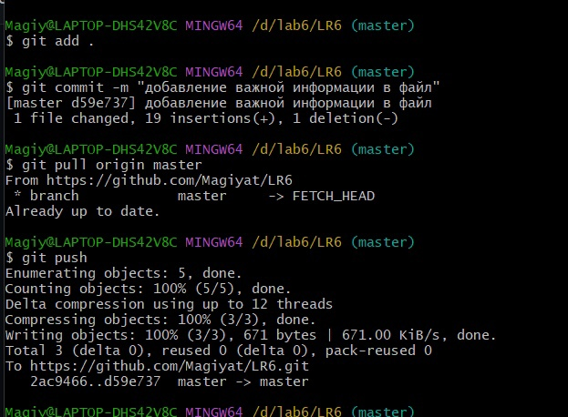

Рисунок 9 - Коммит добавление важной информации

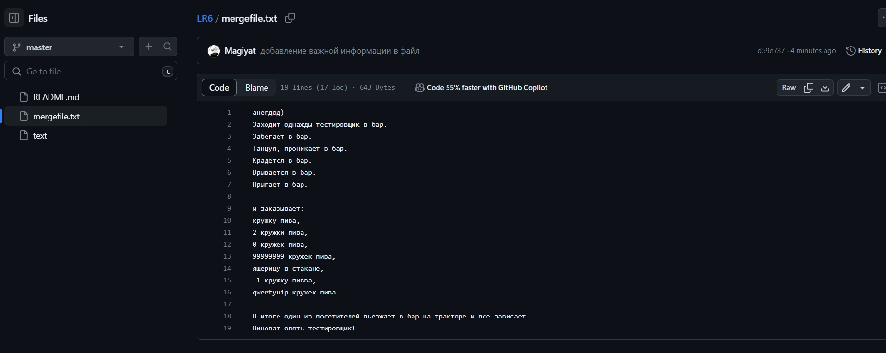

Рисунок 10 - Содержимое файла merdefile

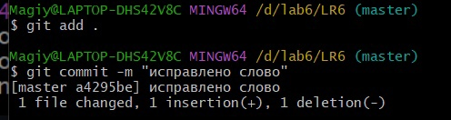

Рисунок 11 - Коммит с исправлением слова 

### 8. Откат коммита

Рисунок 12 - Откат коммита 

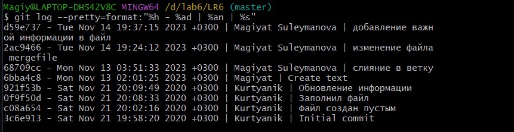

Рисунок 13 - Получение истории операций в форматированном виде  

### 9. Создание ветки для отчета
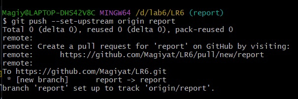

Рисунок 14 - Создание ветки для отчета

